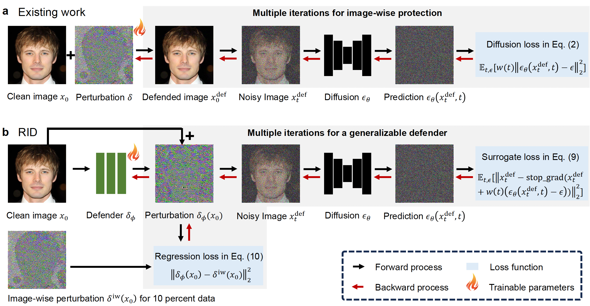

<p align="center">

  <h1 align="center">Real-time Identity Defenses against Malicious Personalization of Diffusion Models</h1>
</p>
  <p align="center">
    <a href="http://arxiv.org/abs/2412.09844"></a>
  </p>

# :label: News!

* Trained real-time identity defenses models are available ([https://drive.google.com/file/d/1qP1kcjz6fSzevWSEWFucJS7gDWk88-35/view?usp=sharing](https://drive.google.com/drive/folders/1EU49JpKiOy_IB4U0KdBuU-7k58WCi0JP?usp=share_link))here</a> to reproduce results in this paper.

## 🔎 Overview framework



# System Requirements

## Hardware Requirements

The `RID` library requires a GPU with at least 10 GB of VRAM for inference. If using CPU, one core is sufficient, and the RAM requirement is 16+ GB. For training, a GPU with 40 GB of VRAM or higher is necessary, along with at least 4 CPU cores (3.3 GHz or higher), and 16 GB of RAM. 

## Software Requirements

### OS Requirements

The development version of the package has been tested on *Linux* operating systems. The package is compatible with the following systems:

- **Linux**: Ubuntu 16.04
- **Mac OSX**: Supported
- **Windows**: Supported

Before setting up the package, users should have Python version 3.8 or higher installed, along with the necessary dependencies specified in the `requirements.txt` file. No need for any non-standard hardware.


# Installation Guide

### Install from Github
```
git clone https://github.com/Guohanzhong/RID
cd RID

# create an environment with python >= 3.8
conda create -n RID python=3.8
conda activate RID
pip install -r requirements.txt
```

# Inference Demo

## RID inference to protect your images !
To carry out the defense on your own image, to run the following commands and changes the model path and images-folder path.
```sh
python infer.py -m 'model_path' -f 'folder_path' 
```
This will process a whole folder in 'folder_path' and save all the protected images in the '/output_folder/', the processing speed is 8 images per second when using A100.
'model_path' is the checkpoint of RID network, which can download from ([Google Drive](https://drive.google.com/drive/folders/1EU49JpKiOy_IB4U0KdBuU-7k58WCi0JP?usp=share_link)).

## Evaluation the performance of protection
### Personalization methods 
In order to evaluation the protection performance, based on [Diffusers](https://github.com/huggingface/diffusers), run the personalization using the following commands
```sh
cd tuning-based-personalization
accelerate launch --main_process_port $(expr $RANDOM % 10000 + 10000) train_sd_lora_dreambooth_token.py  --config=config/sd_lora.py  
```
'config/sd_lora.py' contains the parameters needed for personalization training. ‘train_sd_lora_dreambooth_token.py' is used for training the 'LoRA+TI', costs about 10 minutes to train. While set 'config.use_lora = False' in 'config/sd_lora.py', the personalization method becomes 'TI', which costs 5 minutes to train.

The following command is use the 'DB' as the personalization method, which costs 30 minutes to train.
```sh
cd tuning-based-personalization
accelerate launch --main_process_port $(expr $RANDOM % 10000 + 10000) train_sd_dreambooth_token.py  --config=config/sd.py  
```

# Training scripts

## Prepare the dataset

In order to train RID, we need to first prepare the training dataset, which consists of the original dataset as well as protected image-image data pairs constructed using a gradient-based approach.

The pairs data is important for training the RID. To generate the pairs data, we use the [Anti-Dreambooth](https://github.com/VinAIResearch/Anti-DreamBooth) library to generate the corresponding perturbation for each image and store these pairs for the following training.

```sh
cd gradient-based-attack
accelerate launch --num_processes 1 aspl_ensemble.py --pretrained_model_name_or_path "" --instance_data_dir_for_train "" --instance_data_dir_for_adversarial ""  --pgd_eps "" --output_dir ""
```
where 'pretrained_model_name_or_path' denotes the pre-trained models use for generation pairs data, it should be aligned with the process of training the RID in the following.
'instance_data_dir_for_train' and 'instance_data_dir_for_adversarial' denote the same clean images folder, while the images are directly stored in this folder.
'output_dir' denotes the output dir for protected images.
'pgd_eps' denotes the perturbation scale, with higher scale, the protection is more visible. We recommand to set the perturbation scale as 12/255.

## Training the RID

After preparing the dataset, run the following commands to train the RID,
```sh
sh train_sd_ensemble_dmd.sh
```
or
```
accelerate launch train_sd_ensemble_dmd.py \
    --pretrained_model_name_or_path ""
    --vad_output_dir "./train_cache/image/sd-vgg-ensemble_dmddit_12-255_sds" \
    --output_dir "./train_cache/pth2/sd-vgg-ensemble_dmddit_12-255_sds" \
    --data_json_file "eps-12_255-mom_anti-a9f0/VGGFace-all.json" \
    --pair_path "eps-12_255-mom_anti-a9f0/output_pairs.json" \
    --tensorboard_output_dir "logs/sd-vgg-ensemble_dmddit_12-255_10l1_all" \
    --resolution 512 > ./logs/sd-vgg-dmd_sds-12-255_sds.log 2>&1 &
```

where 'pretrained_model_name_or_path' denotes the pre-trained diffusion models we use in training, to use the ensemble models to train, set 'pretrained_model_name_or_path' as 'model_1,model_2,model_3'.

'data_json_file' denotes the a JSON file that stores a list of dictionaries. Each dictionary in this list must have at least one key "image_file", which represents the file path of an image. In our paper, we use the VGGFace2 as the raw dataset.
For instance, 
```
[
    {"image_file": "1.png"},
    {"image_file": "2.png"},
]
```
The 'pair_path' should also be a JSON array where each element is a JSON object. Each object must contain two keys: "source_path" and "attacked_path". The value corresponding to "source_path" is the file path of the source image, and the value corresponding to "attacked_path" is the file path of the protected image which is generated using the Anti-DB. 
For instancce, 
```
[
    {"source_path": "source_1.png", "attacked_path": "attacked_1.png"},
    {"source_path": "source_2.png", "attacked_path": "attacked_2.png"},
]
```
The order and number of elements do not need to be the same for both jsons.

'output_dir' denotes the the output dir for the trained RID network. 'vad_output_dir' represents the output of RID during training.

We also provide the ability to optimize the RID using only regression, using the following command,
```sh
sh train_sd_ensemble_reg.sh
```
Training RID costs about 7 days with 8 A100-40G.

# Pseudocode
### Pseudocode of Inference
```pseudocode
Inference Algorithm: Image Protection with RID
Input: 
    - images: Batch of normalized images ∈ [-1, 1] (shape [B, C, H, W])
    - RID_net: Pretrained perturbation generator
Output: 
    - protected_images: Protected images ∈ [-1, 1]

Process:
1. Generate perturbations:
    # Real-time protection
    Δ = RID(images)  ▹ Matching shape [B, C, H, W]
    
2. Apply perturbations:
    protected = images + Δ
    
3. Clip to valid range:
    protected = clamp(protected, min=-1.0, max=1.0)

return protected
```
### Pseudocode of our RID library
```
└── infer.py                      ## inference code using trained RID
└── train_sd_ensemble_dmd.sh      ## training scripts using Adv-SDS
└── train_sd_ensemble_dmd.py      ## training code using Adv-SDS
└── train_sd_ensemble_reg.sh      ## training scripts using only regression
└── train_sd_ensemble_reg.py      ## training code using only regression
└── tuning-based-personalization/ ## the peronsonalization code
    └── train_sd_dreambooth_token.py        ## train DB
    └── train_sd_lora_dreambooth_token.py    ## train Lora+TI/TI
    └── config   ## config using in training personalization
        └── sd_lora.py    # config for Lora+TI/TI
        └── sd.py         # config for DB
    └── ...
└── gradient-based-attack/         ## the code for generation pairs data using gradient-based protection methods
    └── aspl_ensemble.py           ## gradient-based protection code
    └── ...
└── evaluation/                    ## Quantitative evaluation code
```

# :hearts: Acknowledgement

This project is heavily based on the [Diffusers](https://github.com/huggingface/diffusers) library, [DiT](https://github.com/facebookresearch/DiT) libary, [Anti-Dreambooth](https://github.com/VinAIResearch/Anti-DreamBooth) library.
Thanks for their great work!


# License
This project is covered under the **MIT License**.
